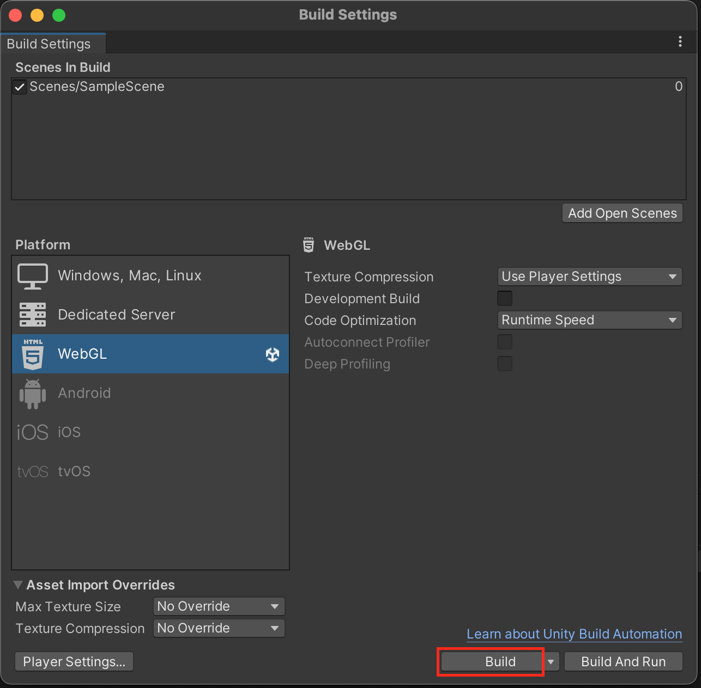

# Word Hunt Recreated

## Contributing

Upon request, here is a way to download and modify this project within Unity:

1. Download and configure [Unity Hub](https://unity.com/download).

    - You will need to create a free Unity account upon opening the application.

1. Download [Unity version 2022.3.9f1](https://unity.com/releases/editor/whats-new/2022.3.9#installs) (should redirect you to Unity Hub).

1. Get the *Word Hunt Recreated* Unity project:

    - **With Git:** Clone the repository.

    - **Without Git:** Download and unzip the .ZIP file for this repository:

        - 

1. Add the project folder via Unity Hub:

    - 

1. Open and modify the project.
    - Initializing the project for the first time may take longer than subsequent opens.
    - If contributing to the project, create a pull request for any new features or changes.

1. (OPTIONAL) Build and update the project.
    - Within the Unity Editor, navigate to ```File -> Settings -> Build Settings```.
    - Choose a platform: if building to a website, select the *WebGL* option. If building for mobile, select either *Android* or *iOS*.
        - Please ensure you have the corresponding [build modules](https://docs.unity3d.com/2020.1/Documentation/Manual/GettingStartedAddingEditorComponents.html) downloaded for your editor version if trying to build for mobile.
    - Configure any build settings specific to your platform.
    - Click "Build" and select a folder you want to save the build in and wait for Unity to finish.

        - 

    - Upload your build to the corresponding platform.
        - For WebGL, consider making an account for and uploading to [itch.io](https://itch.io/t/3260941/packaging-your-unity-game-for-itchio-a-step-by-step-guide).