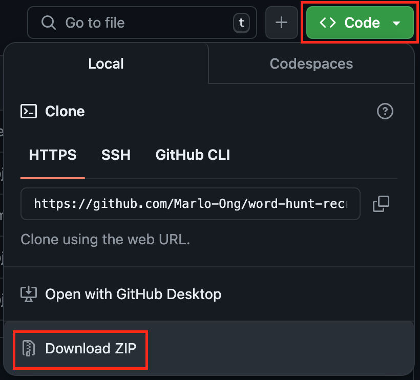
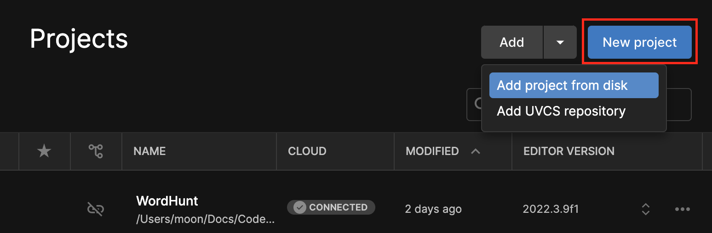

# Word Hunt Recreated

## Contributing

Upon request, here is a way to download and modify this project within Unity:

1. Download and configure [Unity Hub](https://unity.com/download).

    - You will need to create a free Unity account upon opening the application.

1. Download [Unity version 2022.3.9f1](https://unity.com/releases/editor/whats-new/2022.3.9#installs) (should redirect you to Unity Hub).

1. Get the *Word Hunt Recreated* Unity project:

    - **With Git:** Clone the repository.

    - **Without Git:** Download and unzip the .ZIP file for this repository:

    

1. Add the project folder via Unity Hub:

    

1. Open and modify the project.
    - Initializing the project for the first time may take longer than subsequent opens.
    - If contributing to the project, create a pull request for any new features or changes.